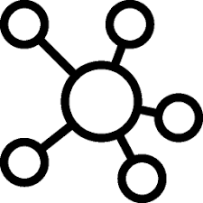

<!-- page_number: true -->
<!-- footer: Écosystème du web -->

Écosystème du web
===

##### Les acteurs et leur environnement

###### par [Fabien Barbaud](fabien.barbaud@timeonegroup.com) - [@BarbaudFabien](https://twitter.com/BarbaudFabien)

---

# Définition écosystème

Système formé par un environnement (biotope) et par l'ensemble des espèces (biocénose) qui y vivent, s'y nourrissent et s'y reproduisent.

[Larousse](http://www.larousse.fr/encyclopedie/divers/%C3%A9cosyst%C3%A8me/45649)

---

# L'écosystème web

* Environnement : Web
* Espèces : organismes publiques et privées, personne physique, IA, ...

---

# Le Web (*World Wild Web*)

Le World Wide Web (WWW), [...] communément appelé le Web, [...] est un système **hypertexte public** fonctionnant sur Internet. Le Web permet de consulter, avec un **navigateur** des pages accessibles sur des **sites**. L’image de la toile d’araignée vient des hyperliens qui lient les pages web entre elles.
Le Web **n’est qu’une des applications d’Internet** distincte d’autres applications comme le courrier électronique, la messagerie instantanée et le partage de fichiers en pair à pair.

[Wikipedia](https://fr.wikipedia.org/wiki/World_Wide_Web)

---

# Objectif de la journée

Construire collaborativement une représentation de l'écosytème web

---

# Mind Mapping

## Un outil pour synthétiser nos idées dans un schéma structuré

Issu des mots anglais « mind » qui signifie « esprit, intelligence » et « map » qui signifie « carte », l'idée du « mind-mapping » consiste en une carte heuristique (carte des idées), ou encore un topogramme qui s'articule tout simplement de la façon suivante :
* au centre une idée générale : souvent représentée par un mot, un dessin ou une photographie ;
* autour de cette idée générale : un ensemble de ramifications ou arborescence qui se rattachent à l'idée maîtresse.

[ooreka](https://coaching.ooreka.fr/comprendre/mind-mapping)

---

# L'environnement

---

# Les acteurs

---

# Leurs interactions

---

# Les nouveaux métiers

